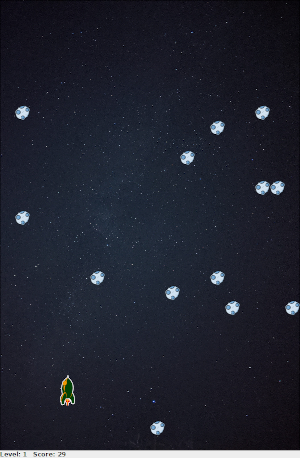

# Don't get Hit

The ultimate goal of this game is stated clearly in it's name: **Don't get Hit** by an asteroid at all cost.




## Build an run the application (jar file)
```shell
$ make 
```

## Run the application (jar-file)
```shell
$ make run
```

Alternativ approach
```shell
$ java  -jar DoNotGetHit.jar
```


# Resources 
- Fairydust icon (Link: https://www.iconspng.com/image/101060/fairydust)
- Backgound image (Link https://www.pxfuel.com/en/free-photo-xgkky, Licence: Free for commercial use)
- Asteroid Icon (Author: James George, Licence: CC BY-NC 4.0, Link:
https://icons-for-free.com/lineal+with+color+asteroid-1320109758754018058/)
- Explosion icon ( Licence: Pixabay License, Link: https://pixabay.com/p-155624)
